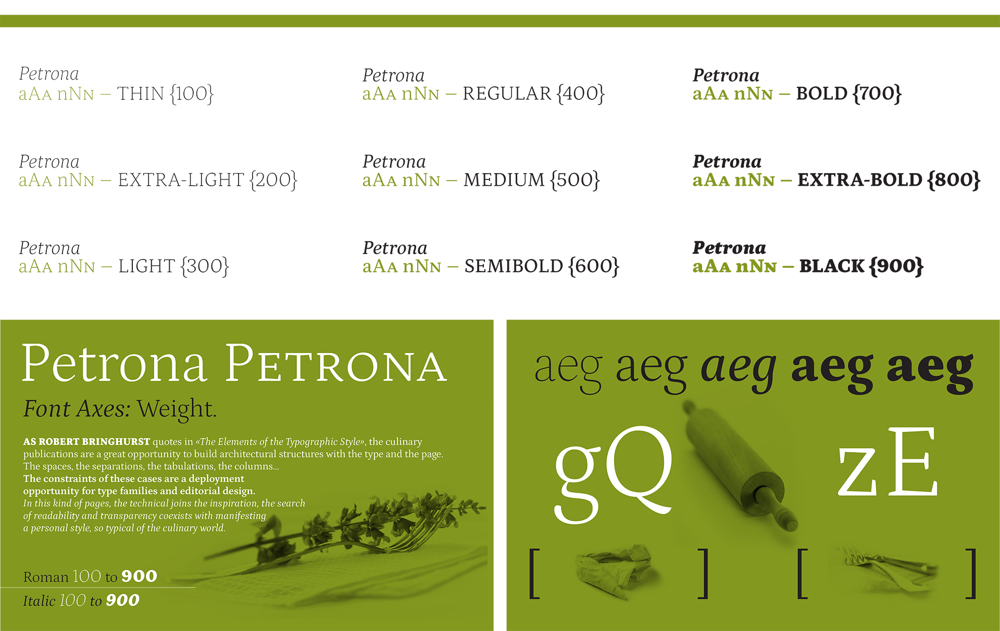

# Petrona Font Family

The Petrona Font Family is currently being built as a Variable Font. 

Composed of a Roman and Italic, Latin Expert, supporting 222 languages. 

Masters: Roman Default, Roman Weight Min, Roman Weight Max, Italic Default, Italic Weight Min, Italic Weight Max. 

Instances: Roman 100 to 900, Italic 100 to 900. 

Font Axes: Weight. 

# Description 

How many characteristics is it possible to add to a font, without modifying its text-type genre? Petrona is inspired by every home's cook, who playfully maneuvers ingredients and decors with a personal touch, without derailing from an original recipe. This font has been created “in the kitchen,” with sharp elements that forge its structure as well as gestural strokes for softer finishing touches. Isolated, its glyphs are just like ingredients. Caps with heavy asymmetric serifs and arms of inverted angles, for a sharp flavor. Lower cases with big x-height, pronounced ascenders, and soft curves of low contrast, for a complementary flavor. When forming a word like in a headline, the fusion of these different ingredients offer a distinctive note. And they harmonically mingle into a paragraph, with a new visual menu proposed by the text. Petrona has all the characteristics of a font for editorial use, from headlines to paragraphs. It’s intended to be applied in pages with texts, and also in pages with tabular organizations, like designs with recipes, ingredients, quantities, or similar structures. This is why connoisseurs recommend it for culinary texts. But taste and creativity are personal, for which each one will apply it according to their preference. Awards/Accomplishments: Tipos Latinos. 

# The next W.I.P. version will include: 
Complete set of Italics (reviewing Black Italic).
