# Petrona Font Family

Petrona is a Typeface Family. Variable Font. Roman and Italic. Latin Expert. 

Masters: Roman Default, Roman Weight Min, Roman Weight Max, Italic Default, Italic Weight Min, Italic Weight Max.

Instances: Roman 100 to 900, Italic 100 to 900.

Font Axes: Weight.

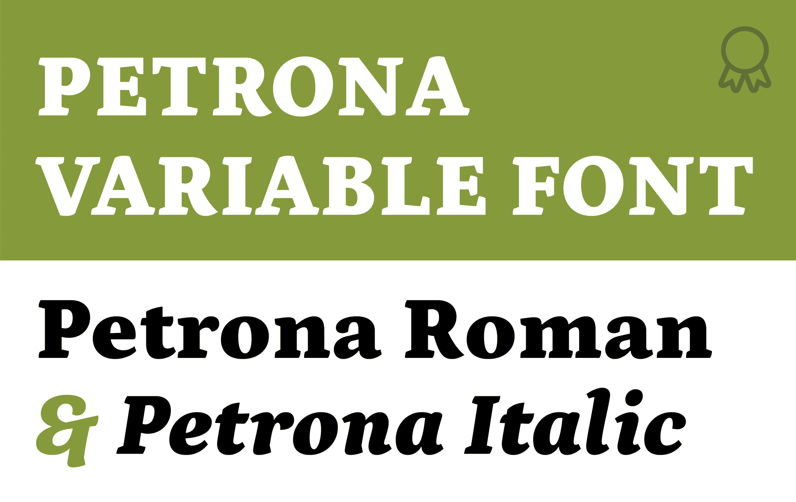

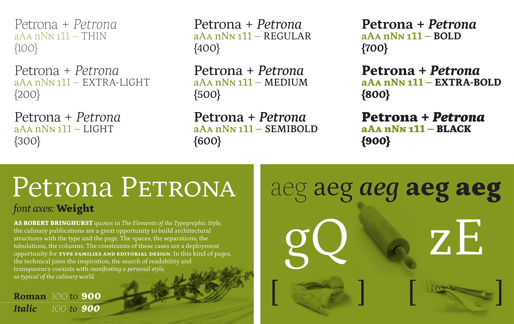
. 
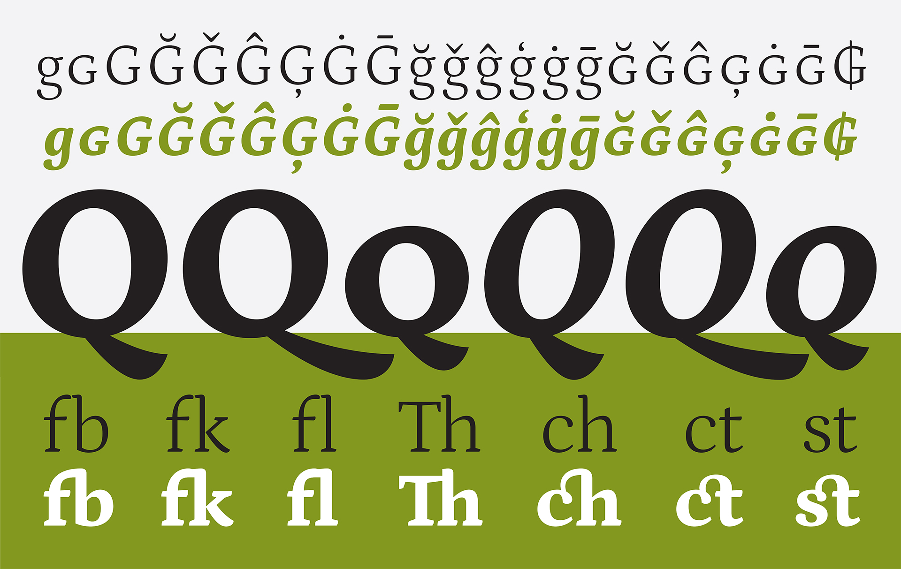

## Description 

Petrona’s personality is an answer to how many characteristics can be added to a typeface without undermining its purpose within the text-type genre. Petrona playfully maneuvers plenty of personal touches, without losing the essence of a design intended for legibility in digital and print media, from headlines to body text. Uppercase glyphs have heavy asymmetric serifs and arms with inverted angles, which combine with lowercase designs that share a big x-height, pronounced ascenders, and soft curves of low stroke contrast.

First published in Google Fonts in November 2011 as a single style Roman design, it was completely redrawn in 2019 and 2020. It has evolved, and now offers a comprehensive range of weights, a complete set of corresponding italics, and an extended glyph set that supports over 200 Latin languages. A full set of small caps, plus ligatures, alternates, and all kinds of numerals, fractions, punctuations, symbols, and currencies, are included.

As a variable font, it has a Weight axis in both the roman and italic files.

The previous swashy Q is still available, found in Stylistic Set 1.

It is now a typeface that supplies everything needed for fine text typography.

The Petrona project is led by Ringo R. Seeber from Glyph Co, based in Brooklyn, NY. 

. 
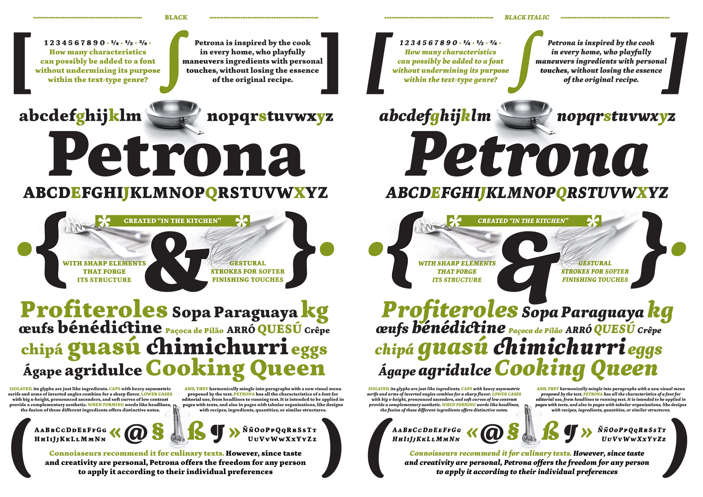
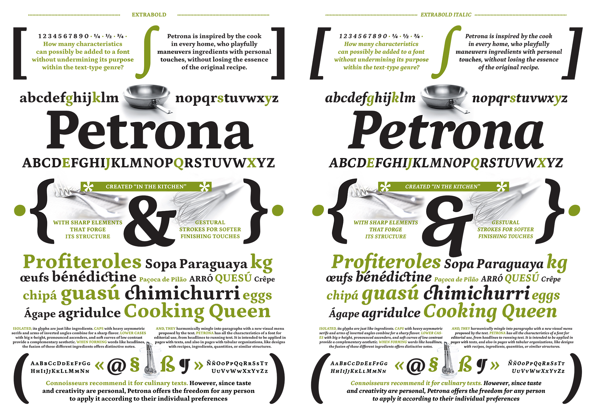
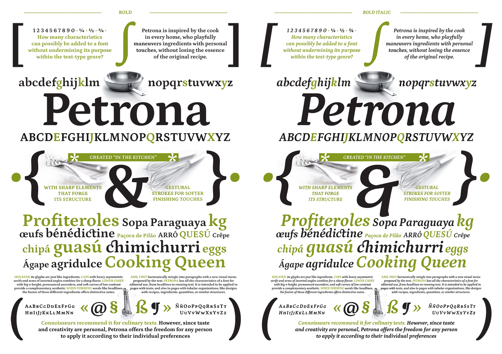
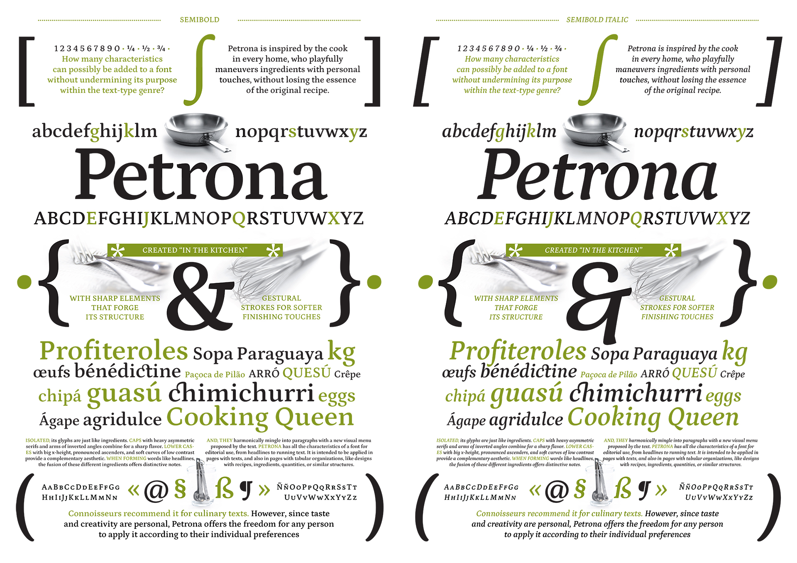
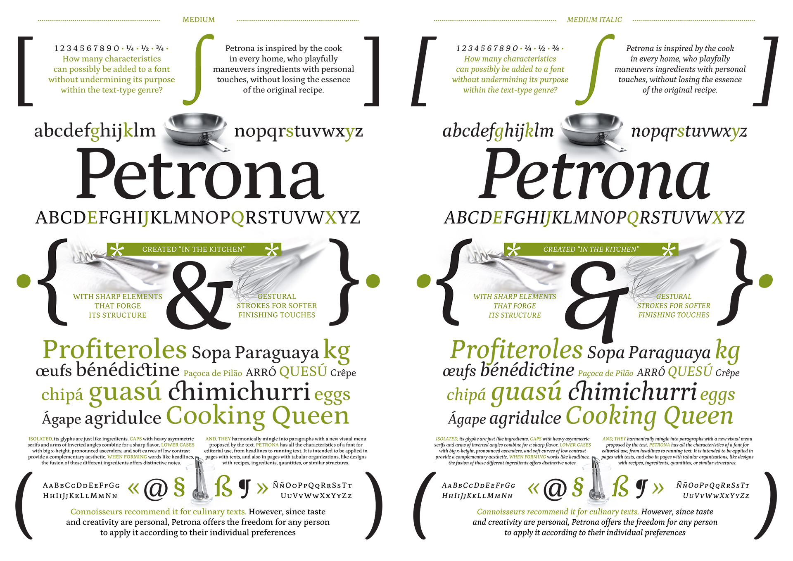
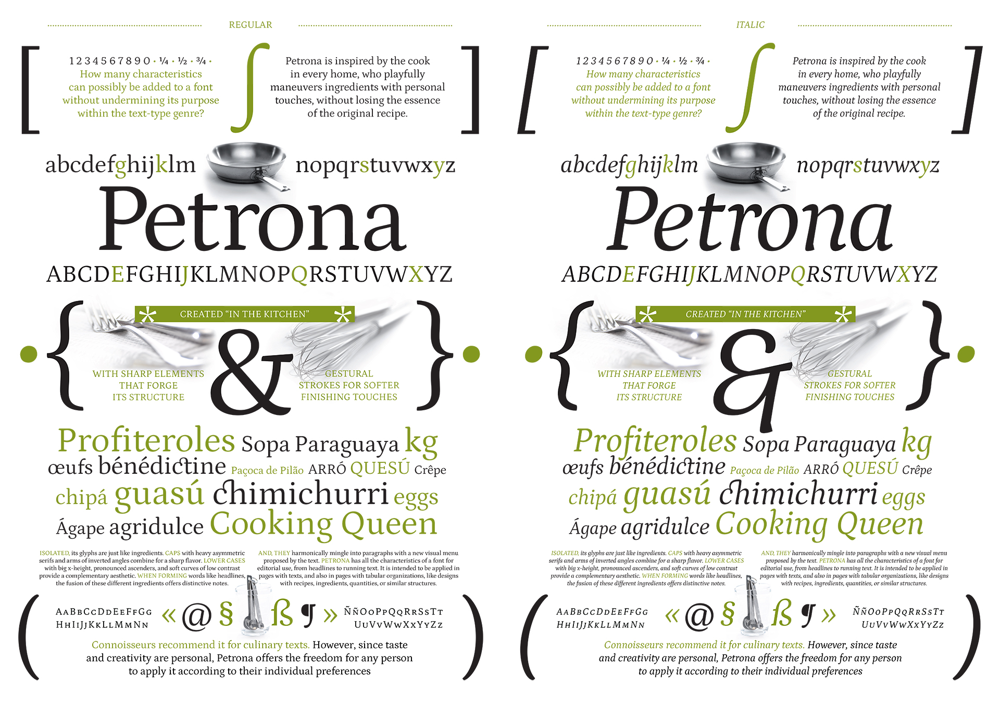
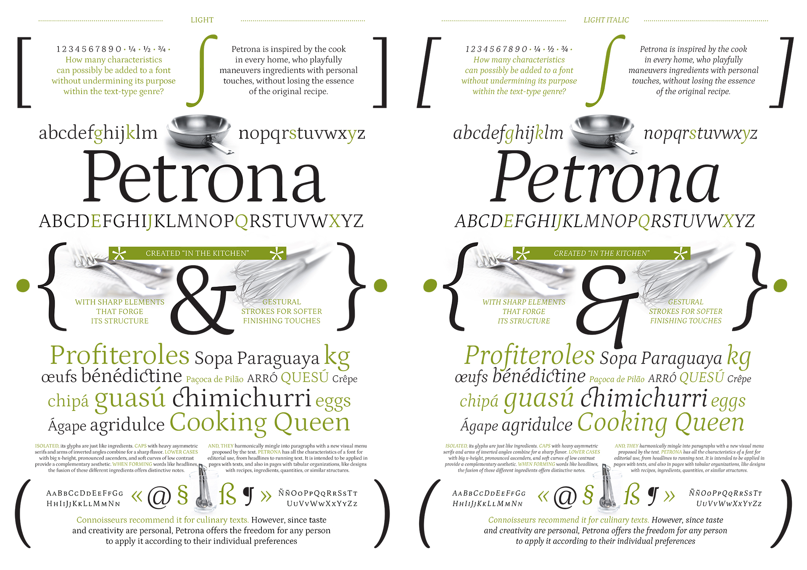
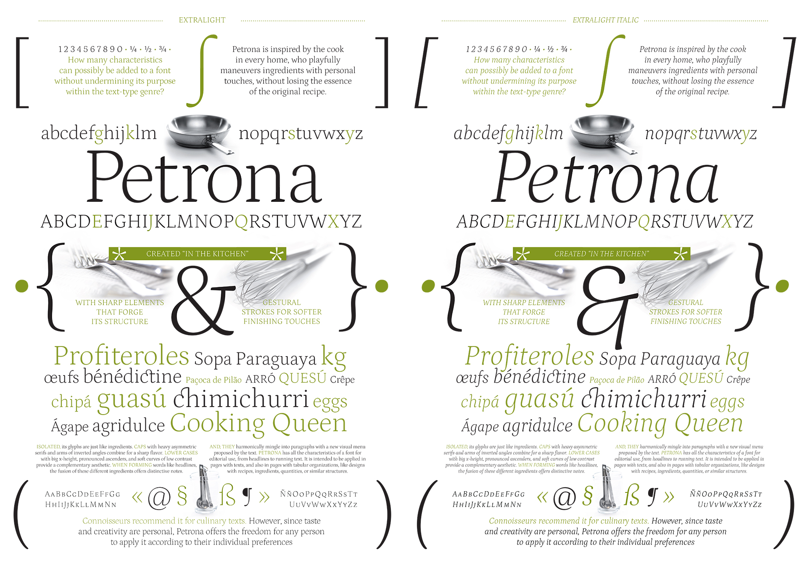
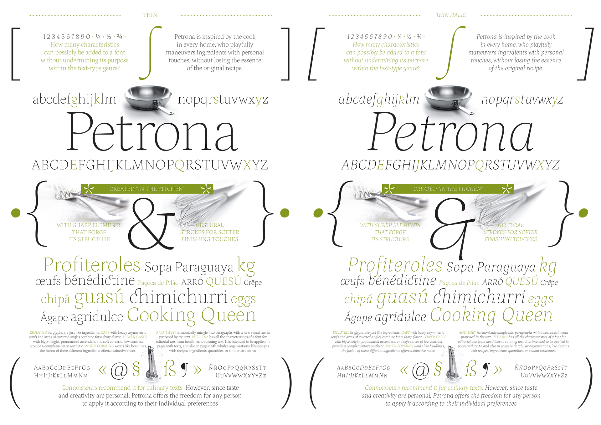
. 
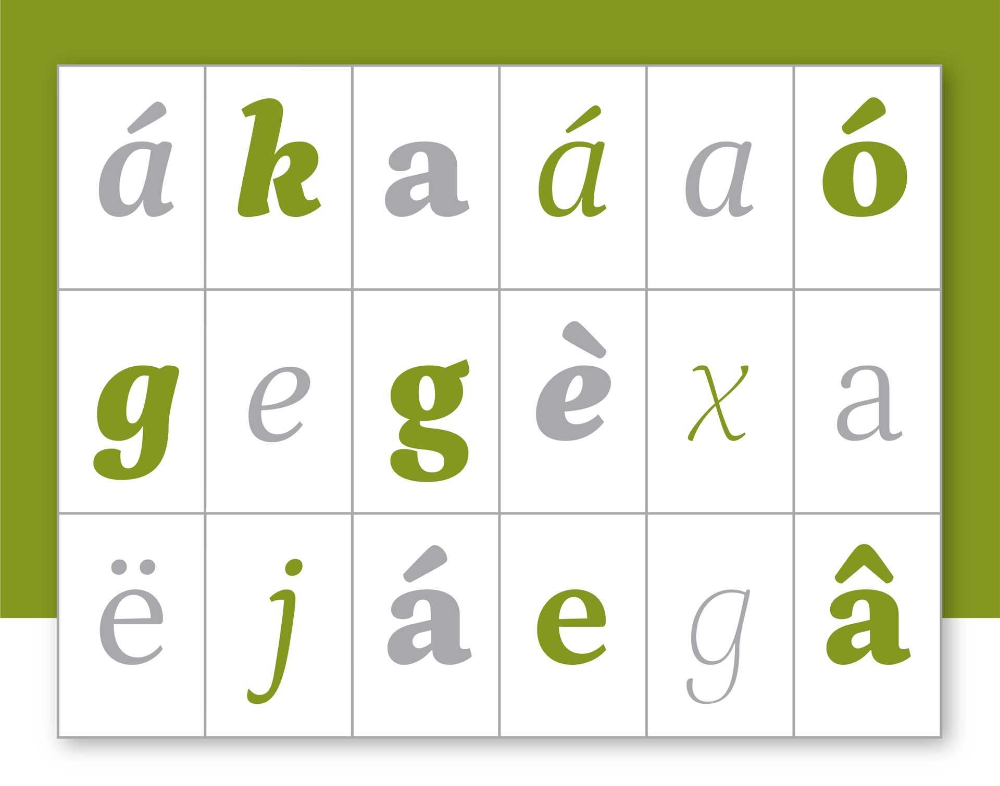
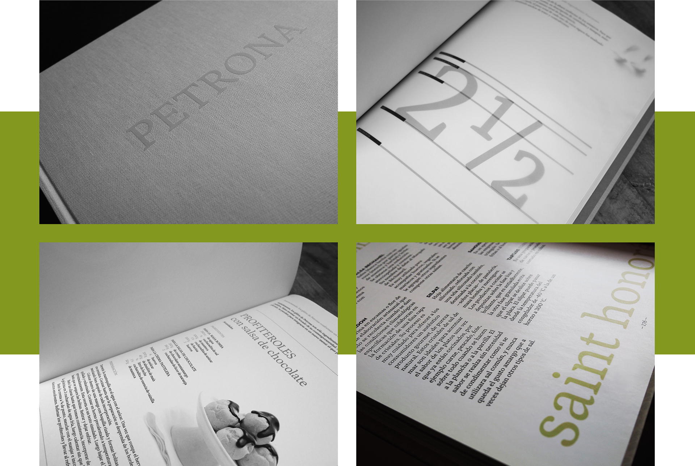

## Version History

Version 2.000 (July 2020): Petrona has been completely redesigned, sports an Italic and lots of weights and is now available as a Variable Font. The Q has been redesigned, with the original swash designed being available in Stylistic Set 1.

## Build

Run `build.sh` from within the `Sources` folder. Requires `fontmake` and `gftools`.
