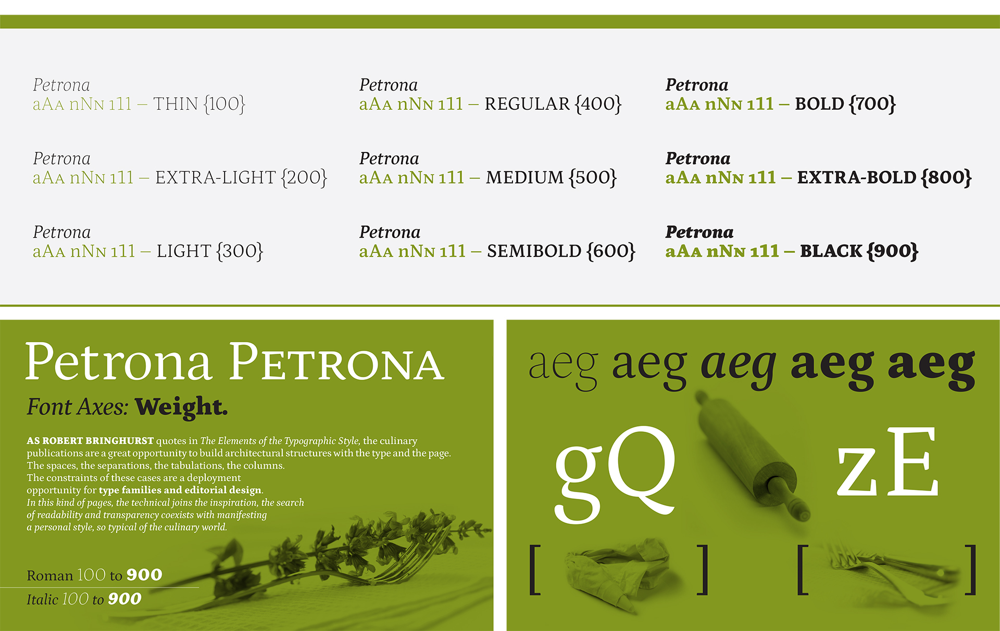
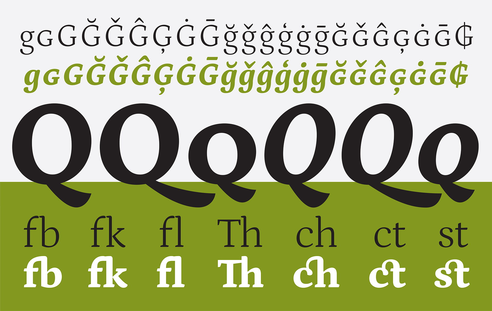
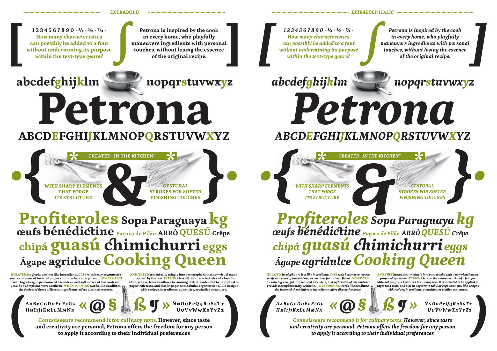
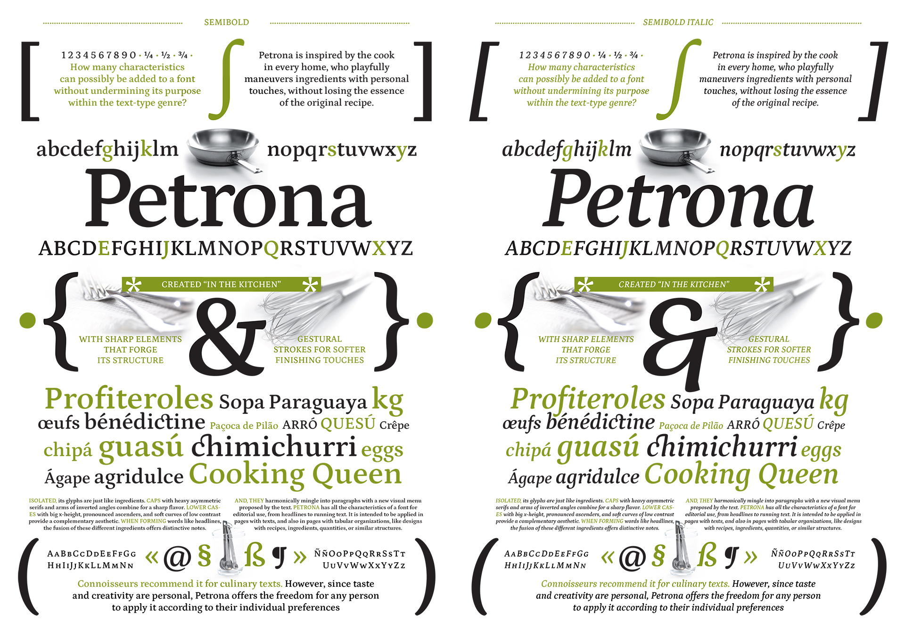
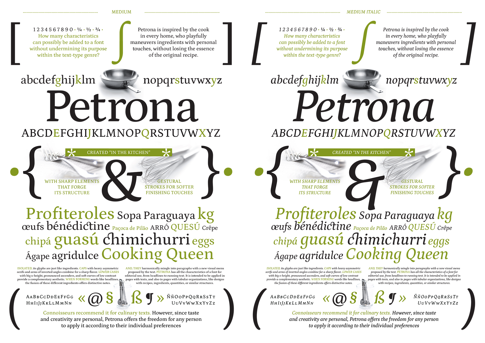
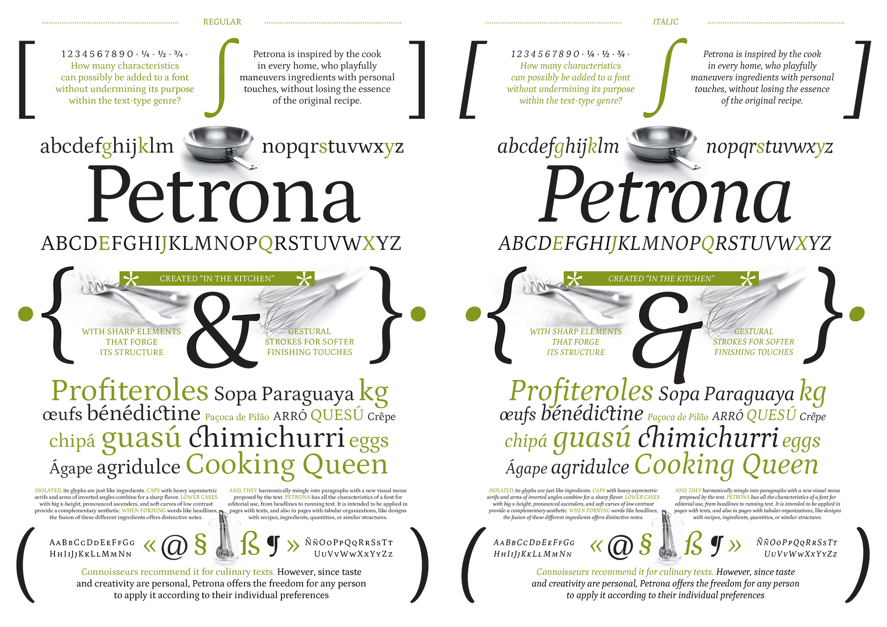
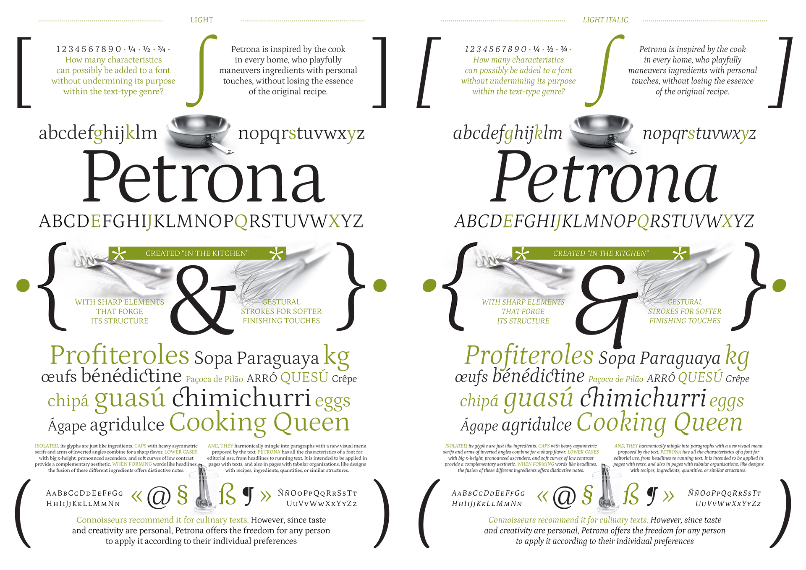
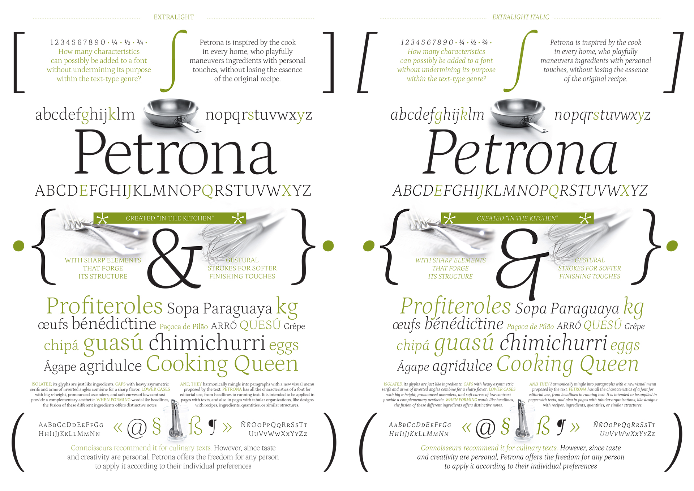
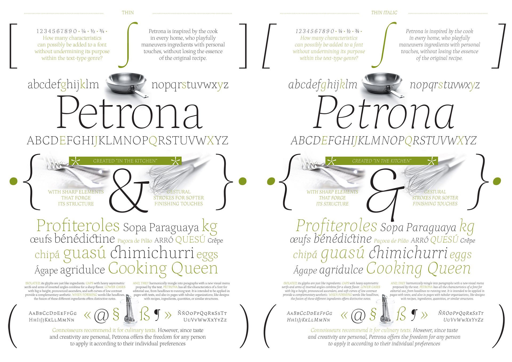

# Petrona Font Family 

Petrona is a Variable Font.

Composed of a Roman and Italic.

Latin Expert. 

Masters: Roman Default, Roman Weight Min, Roman Weight Max, Italic Default, Italic Weight Min, Italic Weight Max.

Instances: Roman 100 to 900, Italic 100 to 900.

Font Axes: Weight.

## Description 

How many characteristics can possibly be added to a font without undermining its purpose within the text-type genre? Petrona is inspired by the cook in every home, who playfully maneuvers ingredients with personal touches, without losing the essence of the original recipe. This font has been created “in the kitchen,” with sharp elements that forge its structure as well as gestural strokes for softer finishing touches. Isolated, its glyphs are just like ingredients. Caps with heavy asymmetric serifs and arms of inverted angles combine for a sharp flavor. Lower cases with big x-height, pronounced ascenders, and soft curves of low contrast provide a complementary aesthetic. When forming words like headlines, the fusion of these different ingredients offers distinctive notes. And, they harmonically mingle into paragraphs with a new visual menu proposed by the text. Petrona has all the characteristics of a font for editorial use, from headlines to running text. It is intended to be applied in pages with texts, and also in pages with tabular organizations, like designs with recipes, ingredients, quantities, or similar structures. This is why connoisseurs recommend it for culinary texts. However, since taste and creativity are personal, Petrona offers the freedom for any person to apply it according to their individual preferences. Awards/Accomplishments: Tipos Latinos. 

